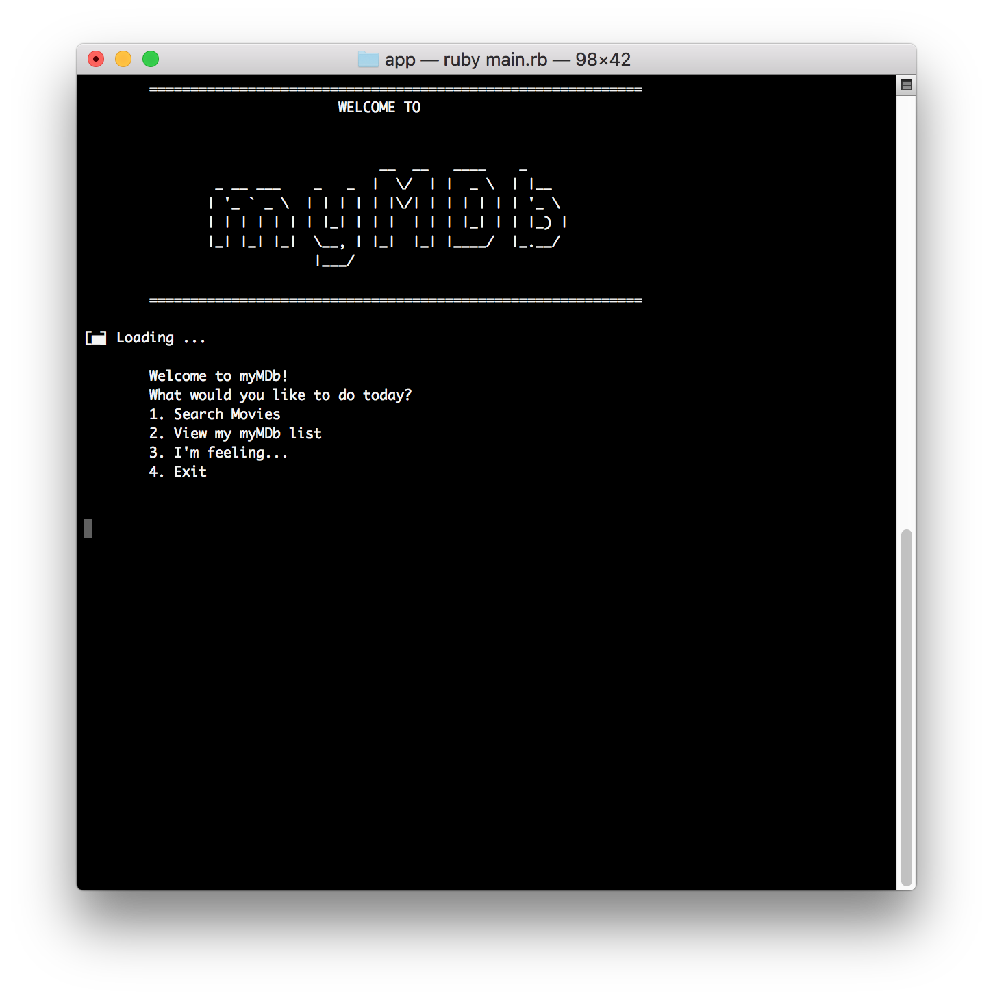
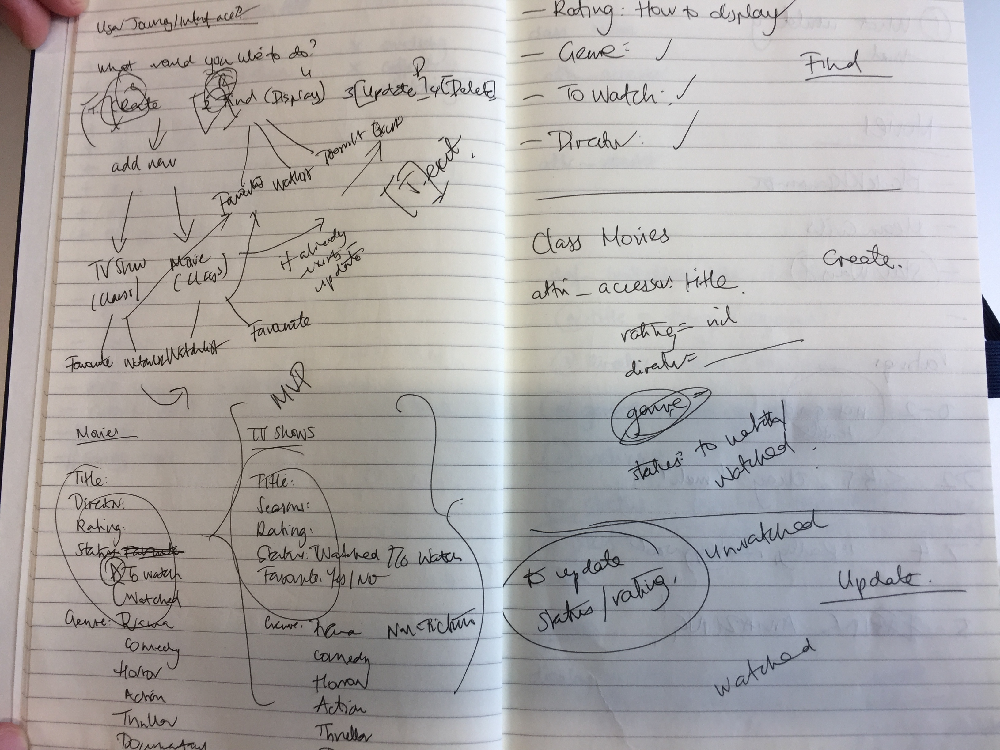
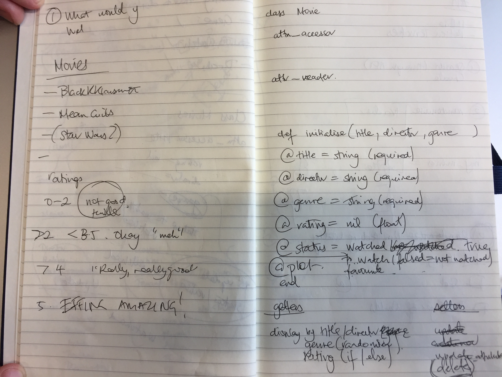
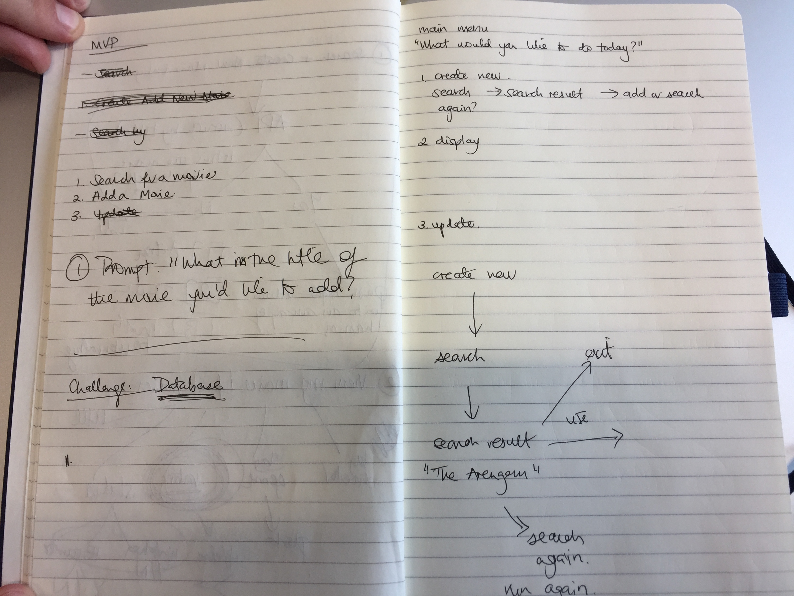
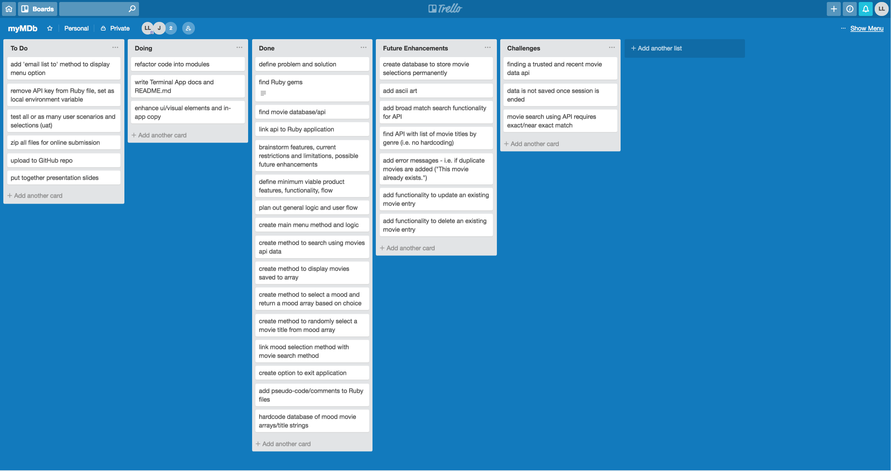
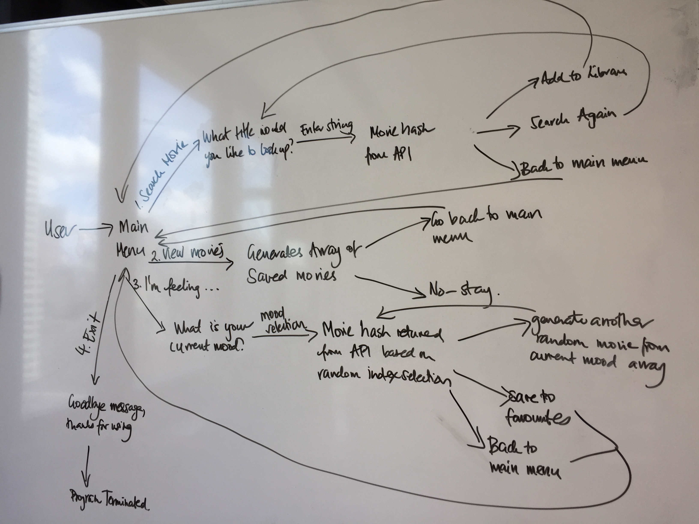

# Terminal App - myMDb
Developed by Linda Lai and James Merrigan (2018)

### GitHub
[View in GitHub](https://github.com/linda-lai/terminalapp)

### Purpose
Made for the modern and minimalist cinephile, myMDb simplifies the process of selecting, saving and suggesting a movie to watch. Within myMDb's current scope as a minimum viable product (MVP), its primary purpose for users is simple: search, suggest, save. Users can easily find, display and add movie titles to their watchlist, or have the application suggest one based on their mood/genre. 

#### Functionality
Based on user inputs, myMDb will return movie information searched by title, a random suggestion based on mood or display a watchlist of movies saved by the user.

myMDb users can search via a specific movie title, which will return movie details (title, genre, director and plot) for the user to view, with the option to save or search again.

Alternatively, users can prompt the myMDb for a suggestion based on current mood, which in turn makes a random selection from a list of movies associated by genre.

Throughout the session, users can use the watchlist option to view all of their saved selections throughout the session.

### Dependencies
The Ruby gems 'tty-font', 'tts-spinner', 'net/http' and 'json' are required to run myMDb.

myMDb returns movie data from the OMDb API (API key required): http://www.omdbapi.com

### Instructions for Use
To initialise program:

```ruby
bundle install
```
This will install the following gemfiles:

'tty-font' <br>
'tty-spinner' <br>
'net/http' <br>
'json' <br>

Open Terminal or preferred console. Enter:

```ruby
$ ruby main.rb
```
From the main menu, make a selection.



## Designing and Planning
### Brainstorming
Paper was used for initial freeform brainstorming and scope definition. The possibilities and limitations for the application were shaped by the finding a suitable API and the kind of movie information and data types it would return. 






### Task Management
Trello allowed us to define the features, flow and logic for a minimum viable product, breakdown and itemise current tasks to be performed and scope out future enhancements or challenges to overcome, in a much more organised and systematic manner.



### User Journey/Workflow


### Project Plan & Timeline
The scope for myMDb's initial build was two days. After finding and testing OMDb's API, our first step was to narrow down the information we wanted to use from the hash returned within our application, and in turn, define what the primary purpose and scope of the MVP would be. Given the two-day turnaround, time management was key, and initial discussions focused on balancing brainstorming possibilities with current limitations. Along the way, current challenges and ideas for future enhancements were noted for our documentation.

Day 1 tasks and time were largely spent on finding suitable Ruby gems and an API for movie data, defining the main workflow, functionality and features, logic for methods on paper and in Trello, and getting a functional base code.

Day 2 tasks and time were largely spent on adding the movie randomiser function, cleaning up and enhancing the user interface, testing user selections, closing any in-app loop gaps, writing documentation and refactoring code into modules.

Following this approach enabled us to break down our tasks and deliverables systematically and overall this meant we felt our time was managed effectively and efficiently.

### Coding Process
After defining the main search, save and suggest function and logic for myMDb's frontend and backend during project planning, the initial focus was to create a minimal but functional base code for each user option. This primarily involved creating numerous methods to search, store and interpolate movie information stored in the hash returned by OMDb's API into an empty array acting as the watchlist displayed to users.

With time permitting, an additional method to suggest a random movie title to users based on selecting their current mood was also included in the initial build. While our long-term preference would be to generate a list of movies by genre from an API, our current workaround was to hardcode a database of arrays by movie genre and randomly select a title value based on the index. We decide to save the array in a separate file to keep the initialise file as clean and readable as possible.

After testing the application to ensure users could loop back to the main menu throughout the program, our final step was to clean up the user interface, add comments in pseudocode and refactor into modules to keep our files and logic streamlined and clearly laid out. Using modules allowed us to move the most sizeable but related methods and data into logical containers to keep our initialise file relatively streamlined and short.

### Challenges
* Scaling back features to the minimum to plot out iterative future enhancements.
* No functionality to export or inbuilt database to store values outside of a single user session or store movie titles for randomiser.
* Finding an API for movie information data retrieval.
* Testing out movie titles stored in randomiser due to exact/near exact search parameters required by API.

### Future Enhancements
* Functionality to export or email list to within display movies option.
* Create a database to store movie shortlist permanently (beyond a single session).
* Enable broad match search parameters using OMDb API.
* Generate a list of movies by genre for randomiser via an API rather than manual hardcoding.
* Add error messages – e.g. if duplicate movies are added (“This movie already exists.”)
* Functionality to update or delete existing movie entries.


        ==========================================================
                                             |
                                  ___________I____________
                                 ( _____________________  )
                               _.-||                    ||
                           _.-'   ||                    ||
          ______       _.-'       ||                    ||
         |      |_ _.-'           ||                    ||
         |      |_|_              ||        fin         ||
         |______|   `-._          ||                    ||s
            /|          `-._      ||                    ||
           / |              `-._  ||                    ||
          /  |                  `-||____________________||
         /   |                    ------------------------
        /____|_______________________|________________|______
        
        Thanks for using myMDB!
        =========================================================
